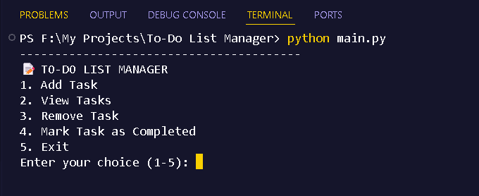
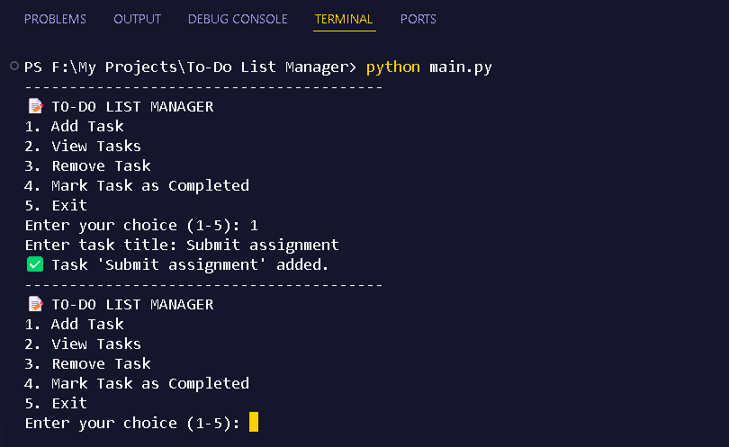
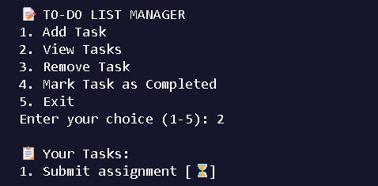
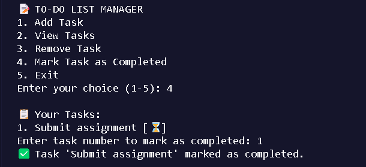
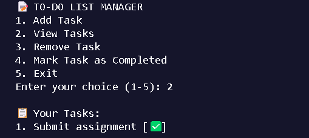

# 📝 CLI To-Do List Manager

---

## 🔧 Description
This is a simple Python Command-Line Interface (CLI) application that lets users manage their daily tasks.

---

## 📦 Features
- Add, view, complete, and remove tasks
- Data stored in `data.json`
- Command-line based interface
- Clean and modular code

---

## 📷 Screenshots

[](assets/result_1.png)
[](assets/result_2.png)
[](assets/result_3.png)
[](assets/result_4.png)
[](assets/result_5.png)

---

## ▶️ How to Run

```bash
python main.py

---
